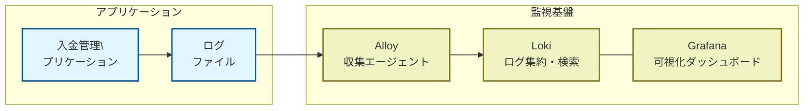

# ログ可視化システム（Grafana, Loki, alloy）

入金管理のログを集約・可視化するためのリポジトリです。Grafana,Loki、Alloyを使用します。




## システム構成

- [Grafana](https://grafana.com/ja/grafana/): ログデータを視覚化するためのダッシュボードを提供（ポート3000）
- [Loki](https://grafana.com/oss/loki/): ログを集約・検索（ポート3100）
- [Alloy](https://grafana.com/docs/alloy/latest/): 各種ログやメトリクスの収集ツール ここではログを収集し、LokiにPushするために使用

## セットアップと実行方法

ローカルで起動する際には以下のコマンドでGrafana,Loki,Alloyを起動します：

```bash
docker-compose up -d
```

### 前提条件

- Docker と Docker Compose がインストールされていること

## Grafanaへのアクセス方法

1. ブラウザで http://localhost:3000 にアクセス
2. デフォルトの認証情報でログイン：
   - ユーザー名: `admin`
   - パスワード: `admin`
3. 初回ログイン時にパスワード変更を促されることがあります（スキップ可能）

## ログの閲覧方法

1. 左側のサイドバーから「Explore」をクリック
2. データソースとして「Loki」が選択されていることを確認
3. クエリフィールドに以下のLogQLクエリを入力：
   ```
   {job="access_logs"}
   ```
4. 「Run Query」をクリックするか、Shift+Enterを押す

## 高度なログクエリ

LogQL（Lokiのクエリ言語）を使用して、より高度なフィルタリングが可能です：

- 特定のテキストを含むログをフィルタリング：
  ```
  {job="access_logs"} |= "ERROR"
  ```

- 正規表現でログをフィルタリング：
  ```
  {job="access_logs"} |~ "GET /api/.*"
  ```

- フィールドを抽出してメトリクスを作成：
  ```
  {job="access_logs"} | pattern `<logfile>:<ip> - - [<date>:<timestamp> <offset>] <responsetime> "<method> <path> HTTP/1.1" <status> <size> "<referrer> "<agent>"`
  ```

## ディレクトリ構造

```
nyukin-observation
├── alloy
│   └── config.alloy        # Alloyの設定ファイル
├── grafana/                # Grafana設定ディレクトリ
│   └── provisioning/       # Grafana自動設定
│       ├── dashboards/     # ダッシュボード設定
│       └── datasources/    # データソース設定
├── loki/                   # Loki設定ディレクトリ
│   └── local-config.yaml   # Lokiの設定ファイル
├── docker-compose.yml      # Grafana,Loki,Alloyのcompose
```

## トラブルシューティング

- コンテナが起動しない場合は、`docker-compose logs`コマンドでログを確認してください。
- Lokiにデータが表示されない場合は、Alloyのログを確認してログ収集が正しく行われているか確認してください。
- 権限の問題がある場合は、マウントされたボリュームの権限を確認してください。

## 停止方法

システムを停止するには以下のコマンドを実行します：

```bash
docker-compose down
```

データを完全に削除する場合は、作成されたボリュームも削除してください：

```bash
docker-compose down -v
```
